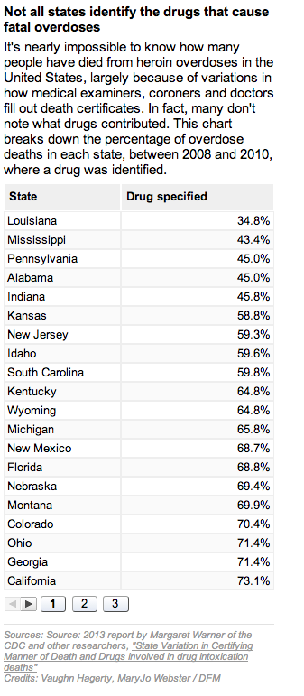

heroin-table
============

What is this?
-------------

Table showing the percentage of drug-overdose death investigations that specify the drug involved, by state

This story ran on May 12, 2014: http://www.nhregister.com/general-news/20140512/scope-of-nationwide-heroin-epidemic-unknown-drug-related-death-overdose-data-lacking

Credits
---------

Vaughn Hagerty, MaryJo Webster

Assumptions
-----------

* Google visualization API

What's in here?
---------------

The project contains the following folders and important files:

* ``index.html`` -- The app html
* ``lib/js`` -- Javascript
* ``lib/css`` -- Strangely enough, stylesheets

License
----------

This code is available under the MIT license. For more information, please see the LICENSE file in this repo.

